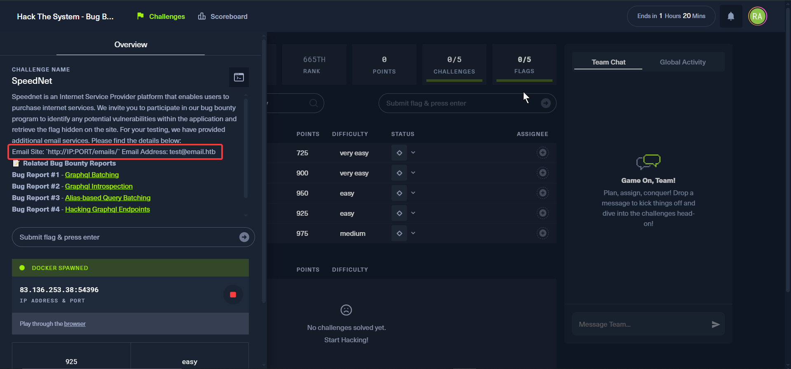

# HackTheBox - Hack the system : bug bounty ctf

# SpeedNet

Assalamualikum.

Hello Guys, What's up? This is Md. Fazle Rabbi aka rahisec.
Recently I participated on Hack the system Bug bounty ctf by HackTheBox. I solved 3 challenges there among them `SpeedNet` challenge bothered me a lot. It says it’s difficulty is easy, yes I also agree with that cause the exploitation was bit easy for pros, but the exploitation path was way more challenging for a junior level pentester. To be honest, i enjoyed it a lot. without any further a due lets get started….

The challenge started with some descriptions and some bugbounty reports from hackerone. which makes it clear that what we are going to do, or what to expect in this challenge.

### Related Bug Bounty Reports:

[https://hackerone.com/reports/2166697](https://hackerone.com/reports/2166697)

[https://infosecwriteups.com/1000-bug-using-simple-graphql-introspection-query-b68da8260877](https://infosecwriteups.com/1000-bug-using-simple-graphql-introspection-query-b68da8260877)

[https://inigo.io/blog/defeating_controls_with_alias-based_query_batching](https://inigo.io/blog/defeating_controls_with_alias-based_query_batching)

[https://www.yeswehack.com/learn-bug-bounty/hacking-graphql-endpoints](https://www.yeswehack.com/learn-bug-bounty/hacking-graphql-endpoints)



Challenge Interface

Just take a look at the Email site. We’ll come back to it later.

After spinning up the docker we get this landing page with login and register option. everything else is a boiler plate.

Lets quickly visit those page and register as a user.


Landing page


registration


logged in automatically

Here above you can see there is a two factor authentication button, we’ll turn it on to test it’s feature later.


billing page


usages page

Lets find out other pages as well


Login page


Forgot password page


This is the email server page for test email `test@email.htb` . `http://ip:port/emails/`

Okay, this was the overview of the website and it’s pages. Now Lets check the traffics it made in burpsuite. I set up burpsuite in the background to capture all the traffics while browsing the webpage.


We can see bunch of graphql endpoint here, hinting that it might be possible for graphql injection to find hidden objects which will gave us the flag. but, my friends it was not that easy.


This graphql query have `userId:2` which through us my information. So i assume there is another user before me. so i changed the `userid:2 to 1`


we got admin `email` and other stuff. noted it down.

As there is a graphql running and we can try graphql scanner called `inql` a burp extension to map the entire graphql structure.


installing inQL


Generate queries


analyze


Here all the structure of graphql is shown,

The interesting Queries and Mutations are `forgotPassword`, `devForgotPassword` `resetPassword` `upadateProfile` `verifyTwoFactor` . We’ll come back to this later.


here is the structure of mutation of devForgotPassword.

Lets see what `/forgot-password` do in backend by capturing it in burp


Password is sent to the provided email. I can easily reset it cause i’ve access to my email. But what if i change the email to admin?


I don’t have have access to admin email. but somehow i need the reset token to takeover the admin.

If you closely check the Mutation Function, it called `forgotPassword` , but we saw earlier there is another function called `devForgotPassword` . lets use it and see what happens.


Surprisingly we got the reset token of admin . This `devForgotPassword` Function was created for testing purpose during production environment. But they forgot to remove that and release with it.

However we’ve got the reset token, now we need to reset the password, we also saw `resetPassword` function, we’ll use it to reset password.


Construct a query according to it.


newpassword: 12345 . and reset it.

Now we’ve email `admin@speednet.htb` and password: `12345` we can log in and get the flag… finally…!!!!


What The Heck!!! Another Layer of security.


how can we suppose to tackle that? Okay, i know what you are thinking right now, bruteforce? or check if there other function which might reveal the otp in response? Yes, this is what i thought and checked carefully every functions under mutation but there were none.

What if bruteforce it? but i don’t know how many digit or otp type of this function. 4 character or 6? only numbers? or mix with alphabet. we really don’t know.

To know this we had a way, do you remember there was a test mail server provided in the description? at first i thought it was useless. But now it comes handy.

Lets create another account under test email. `test@email.htb`

sign up to test account using test email and `turned on two factor auth`


Now log out and try to reset password


checking the email server. here is the reset token, but we need otp. So lets reset password first and log in to the account.


logged in. Now i’m realizing, i didn’t actually need to reset password, just turned on twofactor and login again.
however we got the otp.


From here we noticed, the otp is `4 digit`. only `numerical`. and most importantly it will expire in `5 min`.


This is the response if i pass `wrong` otp


This is the response if i pass right otp.

However, i tried to bruteforcing. when i increased the thread, it showed too many requests. So it was impossible to bruteforce 10,000 otp in 5 minutes.

Then while reading some reports and writeups from hackerone and medium, i came to know that i can send multiple batch of query in one request.

so i tried to double the query and send it to check if it really works or not.


and it works. Now i simplified it.


response


it works. There was a option in inql extension where i can easily perform batch attack. But i don’t know why i can’t make it work.

So i had to write a python script that it will do the following…

- It will make 10 batch of request
- Each batch of request will contain 1000 query containing otp from 0000 to 9999.
- it will check if there is a jwt token or not in response, if it found jwt in response, it will stop the request and show the otp and jwt token.

```
import requests
import sys

ENDPOINT      = "http://83.136.253.38:54396/graphql"
SESSION_TOKEN = "f2286d50-7b89-4483-a049-96a94578b54c"
BATCH_SIZE    = 1000

def build_mutation(start: int, end: int) -> str:
    fields = []
    for i in range(start, end):
        otp   = str(i).zfill(4)
        alias = f"v{otp}"
        fields.append(
            f'{alias}: verifyTwoFactor(token: "{SESSION_TOKEN}", otp: "{otp}") {{ token }}'
        )
    return "mutation {\n  " + "\n  ".join(fields) + "\n}"

def main():
    for batch_idx in range(10):
        low, high = batch_idx * BATCH_SIZE, (batch_idx + 1) * BATCH_SIZE
        print(f"[Batch {batch_idx+1}/10] Trying OTPs {str(low).zfill(4)}–{str(high-1).zfill(4)}…")
        mutation = build_mutation(low, high)

        resp = requests.post(
            ENDPOINT,
            json={"query": mutation},
            headers={"Content-Type": "application/json"}
        )
        try:
            resp.raise_for_status()
        except requests.exceptions.HTTPError as e:
            print(f"  HTTP error: {e}")
            continue

        payload = resp.json()
        data   = payload.get("data", {})     # e.g. { "v0000": None, "v0001": None, … }
        errors = payload.get("errors", [])   # list of { message, path: [alias,...], … }

        invalid_aliases = {
            err["path"][0]
            for err in errors
            if "Invalid or expired OTP" in err.get("message","")
        }

        for alias, result in data.items():
            if alias not in invalid_aliases:
                otp_found = alias.lstrip("v")
                token     = (result or {}).get("token")
                print(f"\n Found valid OTP: {otp_found}")
                print(f"    JWT = {token!r}")
                sys.exit(0)

        print("  ➞ no success in this batch.\n")

    print(" Exhausted all batches; no valid OTP found.")

if __name__ == "__main__":
    main()
```


Then i tried to replace this jwt in the request and tried to access the admin, but it doesn’t actually work. I still don’t know why it doesn’t work,
I tried cookie editor, burp, manipulate requests nothing works.

Then i remembered a graphql query which was made while i turned on the two factor on my account.

The request generated a graphql query where the request was required Authorization header, and in query `twoFactorAuthEnabled:true` . As i was turning on the two factor.

So what i did, I replace the admin’s `jwt` in Authorization header and make the `twoFactorAuthEnabled:false` This Removed two factor auth from admin account.


And then simply Logged into the admin account, without two factor and logged in. in billing page we got the flagggggggg!!!!!


This Was InSaaaneeeee… It Just Boiled up my brain, and in the end when i got the flag it was soooo satisfying that i can’t describe my feelings in words.

./peace
